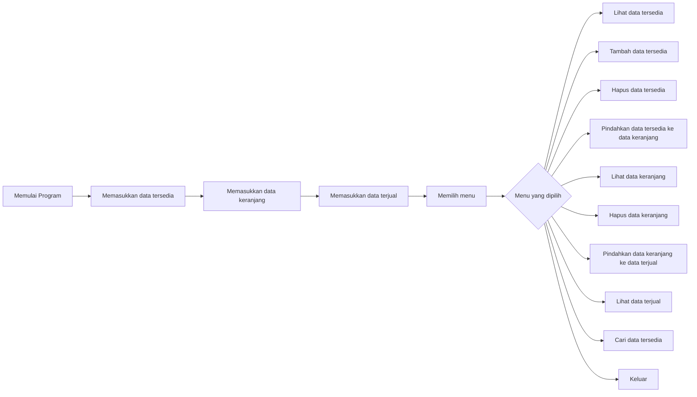
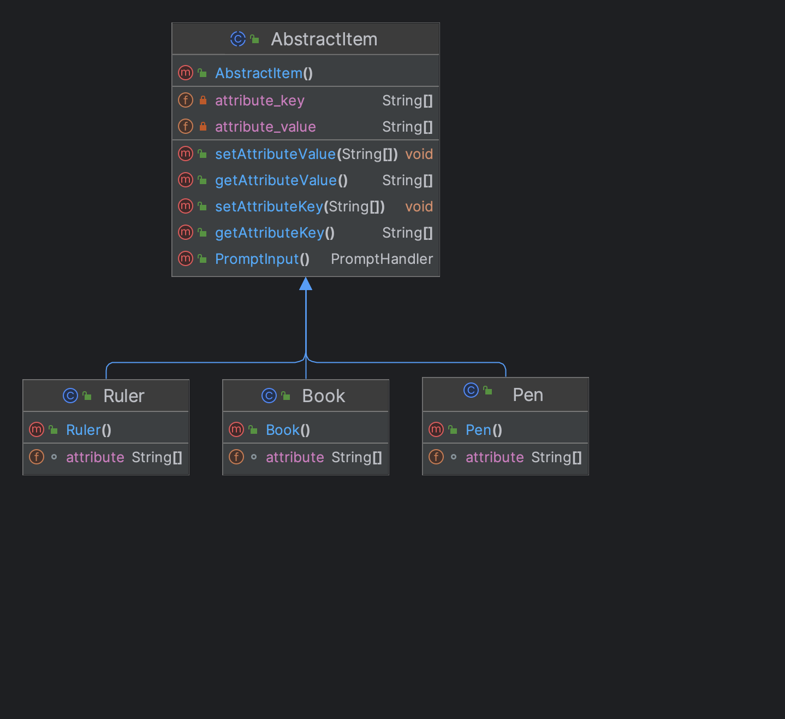

<h2 align="center">LAPORAN TUGAS BESAR JAVA LINKED LIST</h2>
<br>
<p align="center">
    
</p>
<br>
<h4 align="center">
Disusun oleh : <br>
1. Naufal Reky Ardhana (43322021)<br>
2. Akasha Bin Ali (43322001)<br>
3. Aufa Bima Ngahada (43322003)<br>
</h4>

<br><br>

<h3 align="center">
TEKNOLOGI REKAYASA KOMPUTER <br>
TEKNIK ELEKTRO <br>
POLITEKNIK NEGERI SEMARANG <br>
2023
</h3>

<br><br>

### BAB 1 PENDAHULUAN
#### 1.1 Latar Belakang
Laporan ini dibuat untuk memenuhi tugas besar mata kuliah Struktur Data. 
Dalam laporan ini akan dijelaskan mengenai program yang dibuat untuk memenuhi tugas besar mata kuliah Struktur Data. 
Program yang dibuat adalah program yang dapat mengelola data penjualan alat tulis dengan menggunakan double linked list. 
Program ini dibuat dengan menggunakan bahasa pemrograman Java.

Dimana program ini dapat melakukan beberapa hal, yaitu:
1. Menambahkan data tersedia di dalam linked list 
2. Menghapus data yang ada di dalam linked list
3. Menampilkan data yang ada di dalam linked list
4. Mencari data tersedia ada di dalam linked list
5. Memindahkan data dari data tersedia ke data keranjang
6. Menampilkan data yang ada di dalam data keranjang
7. Menghapus data yang ada di dalam data keranjang
8. Memindahkan data dari data keranjang ke data terjual (_checkout_)
9. Menampilkan data yang ada di dalam data terjual
10. Keluar dari program

Program diatas dibuat untuk memudahkan dalam mengelola data penjualan alat tulis.

### BAB 2 DASAR TEORI
#### 2.1 Struktur Data
Struktur data adalah cara menyimpan dan mengorganisasikan data dalam komputer sehingga data tersebut dapat digunakan dengan efisien.
Struktur data merupakan bagian dari algoritma yang sangat penting.
Struktur data yang tepat dapat menghemat waktu dalam menjalankan program dan menghemat ruang penyimpanan dalam komputer.

#### 2.2 Linked List
Linked list adalah struktur data yang terdiri dari kumpulan node yang saling terhubung.
Node adalah sebuah struktur data yang berisi data dan pointer yang menunjuk ke node lainnya.
Node pertama disebut head dan node terakhir disebut tail.
Node yang tidak memiliki node lain yang ditunjuk disebut null.

#### 2.3 Double Linked List
Double linked list adalah struktur data yang terdiri dari kumpulan node yang saling terhubung.
Node adalah sebuah struktur data yang berisi data dan pointer yang menunjuk ke node lainnya.
Node pertama disebut head dan node terakhir disebut tail.
Node yang tidak memiliki node lain yang ditunjuk disebut null.
Double linked list memiliki pointer yang menunjuk ke node sebelumnya dan node selanjutnya.

### BAB 3 METODOLOGI
#### 3.1 Alat dan Bahan
1. Laptop
2. IDE Netbeans atau IntelliJ IDEA
3. JDK 18
4. Java

#### 3.2 Cara Kerja Program
Program terdiri dari 9 linked list yaitu:
1. linked list untuk data tersedia (3)
2. linked list untuk data keranjang (3)
3. linked list untuk data terjual (3)

Tujuan dibuatnya 9 linked list adalah untuk memudahkan dalam mengelola data penjualan alat tulis. 
Seperti berinteraksi dengan data keranjang layaknya keranjang belanja di supermarket, yang bisa memindahkan data dari data tersedia ke data keranjang, menghapus data yang ada di dalam data keranjang, dan menampilkan data yang ada di dalam data keranjang.

Lalu ada data terjual yang berfungsi untuk menyimpan data yang sudah di _checkout_ atau sudah dibeli oleh pembeli.

Program ini memiliki 10 menu, yaitu:
1. Lihat data tersedia
2. Tambah data tersedia
3. Hapus data tersedia
4. Pindahkan data tersedia ke data keranjang
5. Lihat data keranjang
6. Hapus data keranjang
7. Pindahkan data keranjang ke data terjual (_checkout_)
8. Lihat data terjual
9. Cari data tersedia
10. Keluar

#### 3.3 Flowchart

### BAB 4 ISI
#### 4.1 Pengaplikasian kelas abstract pada item (buku, pensil, dan penggaris)
Kelas abstract adalah kelas yang tidak dapat diinstansiasi dan hanya dapat diwariskan ke anak kelas.
Penggunaan kelas abstract pada item (buku, pensil, dan penggaris) adalah untuk memudahkan dalam mengelola data penjualan alat tulis. 
Serta membuat kode lebih bersih, efisien dan efektif.



Di dalam kelas abstract terdapat attribute key dan value yang digunakan untuk menyimpan data yang ada di dalam linked list.
Lalu terdapat method getter dan setter untuk mengambil dan mengubah data yang ada di dalam linked list.
Key yang dimaksud adalah seperti nama, harga, dan ukuran dari alat tulis.
Value yang dimaksud adalah nilai dari nama, harga, dan ukuran dari alat tuli (Faber Castell, 5000, 15cm).

Sedangkan di kelas item harus mendeklarasikan attribute key yang ada di dalam kelas abstract.
Sebagaimana contohnya:
```java
package Items;

public class Book extends AbstractItem {
    String[] attribute = new String[]{
            "brand", "size", "price"
    };
    public Book() {
        super();
        super.setAttributeKey(attribute);
    }
}
```

#### 4.5 Double linked list
Didalam kelas `List` terdapat methods:
1. addLast(String[] attribute, @NotNull AbstractItem item)
2. addFirstByPrompt(AbstractItem item)
3. addLastByPrompt(AbstractItem item)
4. addAfterByPrompt(AbstractItem item)
5. addBeforeByPrompt(AbstractItem item)
6. addAtIndexByPrompt(AbstractItem item, int index)
7. addAtIndex(AbstractItem item, int index)
8. deleteByIndex(int index)
9. deleteAfterByIndex(int index)
10. deleteBeforeByIndex(int index)
11. deleteFirst()
12. deleteLast()
13. searchByString(String search)
14. printFromItem(@NotNull AbstractItem item)
15. getByIndex(int index)
16. getSize()
17. getTotalPrice()
18. newItem(@NotNull AbstractItem item)

#### Method `addLast(String[] attribute, @NotNull AbstractItem item)` digunakan untuk menambahkan data di akhir linked list.
```java
    public void addLast(String[] attribute, @NotNull AbstractItem item) {
        item.setAttributeValue(attribute);
        Node node = new Node(item);
        if (head == null) {
            head = node;
            tail = node;
        } else {
            node.setPrev(tail);
            tail.setNext(node);
            tail = node;
        }
        size++;
    }
```
#### Method addFirstByPrompt(AbstractItem item) digunakan untuk menambahkan data di awal linked list dengan memasukkan data melalui prompt.

```java
    public void addFirstByPrompt(AbstractItem item) {
        Node node = new Node(newItem(item));
        if (head == null) {
            head = node;
            tail = node;
        } else {
            node.setNext(head);
            head.prev = node;
            head = node;
        }
        size++;
    }
```
#### Method addLastByPrompt(AbstractItem item) digunakan untuk menambahkan data di akhir linked list dengan memasukkan data melalui prompt.

```java
    public void addLastByPrompt(AbstractItem item) {
        Node node = new Node(newItem(item));
        if (head == null) {
            head = node;
            tail = node;
        } else {
            node.setPrev(tail);
            tail.setNext(node);
            tail = node;
        }
        size++;
    }
```

#### Method addAfterByPrompt(AbstractItem item) digunakan untuk menambahkan data setelah data yang dipilih dengan memasukkan data melalui prompt.

```java
public void addLastByPrompt(AbstractItem item) {
    Node node = new Node(newItem(item));
    if (head == null) {
        head = node;
        tail = node;
    } else {
        node.setPrev(tail);
        tail.setNext(node);
        tail = node;
    }
    size++;
}
```

#### Method addBeforeByPrompt(AbstractItem item) digunakan untuk menambahkan data sebelum data yang dipilih dengan memasukkan data melalui prompt.

```java
public void addBeforeByPrompt(AbstractItem item, int index) {
        Node node = new Node(newItem(item));
        Node current = head;
        int i = 1;
        while (i < index) {
            current = current.next;
            i++;
        }
        node.setNext(current);
        node.setPrev(current.prev);
        current.prev.next = node;
        current.prev = node;
        size++;
    }
```

#### Method addAtIndexByPrompt(AbstractItem item, int index) digunakan untuk menambahkan data pada index yang dipilih dengan memasukkan data melalui prompt.

```java
public void addAtIndexByPrompt(AbstractItem item, int index) {
        Node node = new Node(newItem(item));
        Node current = head;
        int i = 1;
        while (i < index) {
            current = current.next;
            i++;
        }
        node.setNext(current.next);
        node.setPrev(current);
        current.next.prev = node;
        current.next = node;
        size++;
    }
```

#### Method deleteByIndex(int index) digunakan untuk menghapus data pada index yang dipilih.

```java
public void deleteByIndex(int index) {
        Node current = head;
        int i = 1;
        while (i < index) {
            current = current.next;
            i++;
        }
        if (current.next == null) {
            if (current.prev == null) {
                head = null;
                tail = null;
            } else {
                current.prev.next = null;
                tail = current.prev;
            }
        } else if (current.prev == null) {
            current.next.prev = null;
            head = current.next;
        } else {
            current.prev.next = current.next;
            current.next.prev = current.prev;
        }
        size--;
    }
```

#### Method deleteAfterByIndex(int index) digunakan untuk menghapus data setelah index yang dipilih.

```java
public void deleteAfterByIndex(int index) {
        Node current = head;
        int i = 1;
        while (i < index) {
            current = current.next;
            i++;
        }
        current.next.next.prev = current;
        current.next = current.next.next;
        size--;
    }
```

#### Method deleteBeforeByIndex(int index) digunakan untuk menghapus data sebelum index yang dipilih.

```java
 public void deleteBeforeByIndex(int index) {
        Node current = head;
        int i = 1;
        while (i < index) {
            current = current.next;
            i++;
        }
        current.prev.prev.next = current;
        current.prev = current.prev.prev;
        size--;
    }
```

#### Method deleteFirst() digunakan untuk menghapus data pertama.

```java
    public void deleteFirst() {
        head = head.next;
        head.prev = null;
        size--;
    }
```

#### Method deleteLast() digunakan untuk menghapus data terakhir.

```java
    public void deleteLast() {
        tail = tail.prev;
        tail.next = null;
        size--;
    }
```

#### Method searchByString(String search) digunakan untuk mencari data berdasarkan string yang diinputkan.

```java
    public AbstractItem searchByString(String search) {
        Node current = head;
        while (current != null) {
            for (int i = 0; i < current.item.getAttributeValue().length; i++) {
                String current_data = current.item.getAttributeValue()[i];
                if (current_data.equalsIgnoreCase(search)) {
                    return current.item;
                }
            }
            current = current.next;
        }
        return null;
    }
```

#### Method getTotalPrice() digunakan untuk menghitung total harga dari semua item yang ada di linked list.

```java 
    public int getTotalPrice() {
        Node current = head;
        int totalPrice = 0;
        while (current != null) {
            totalPrice += Integer.parseInt(current.item.getAttributeValue()[2]);
            current = current.next;
        }
        return totalPrice;
    }
```

### Sumber kode program
Sumber kode program dapat diakses pada tautan https://github.com/ardzz/mid-data-structure

### BAB 5 Kesimpulan dan Saran
#### 5.1 Kesimpulan
Dari hasil pembuatan program ini, dapat disimpulkan bahwa:
1. Linked list merupakan salah satu struktur data yang dapat digunakan untuk menyimpan data dengan cara menghubungkan setiap data dengan pointer.
2. Linked list memiliki kelebihan dan kekurangan. Kelebihan dari linked list adalah dapat menambahkan data dengan mudah, sedangkan kekurangan dari linked list adalah tidak dapat mengakses data secara langsung.
3. Linked list memiliki beberapa jenis, yaitu singly linked list, doubly linked list, dan circular linked list.
4. Linked list dapat digunakan untuk menyimpan data dengan jumlah yang tidak diketahui.
5. Linked list dapat digunakan untuk menyimpan data dengan tipe yang berbeda-beda.
6. Linked list dapat digunakan untuk menyimpan data dengan jumlah yang tidak diketahui.

#### 5.2 Saran
Dari hasil pembuatan program ini, penulis memberikan beberapa saran, yaitu:
1. Diharapkan agar pembaca dapat memahami cara kerja dari linked list.
2. Diharapkan agar pembaca dapat memahami kelebihan dan kekurangan dari linked list.
3. Diharapkan agar pembaca dapat memahami jenis-jenis dari linked list.
4. Diharapkan agar pembaca dapat memahami cara mengimplementasikan linked list.
5. Diharapkan agar pembaca dapat memahami kegunaan dari linked list.